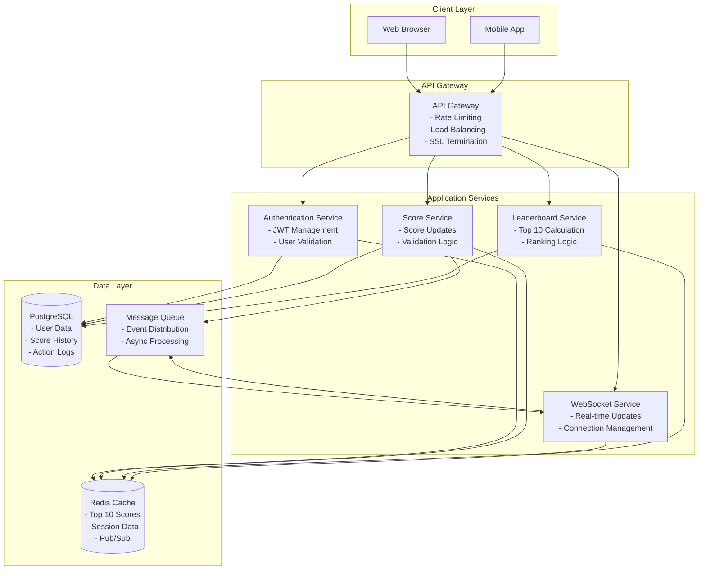
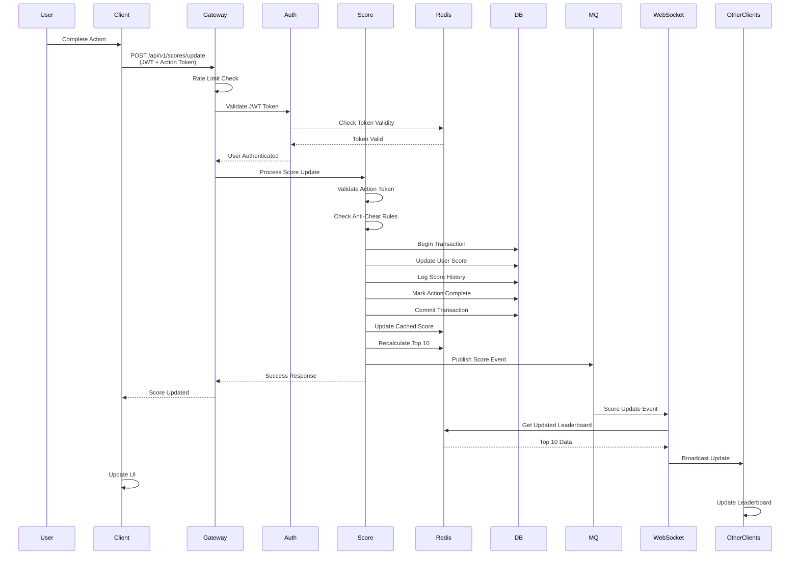
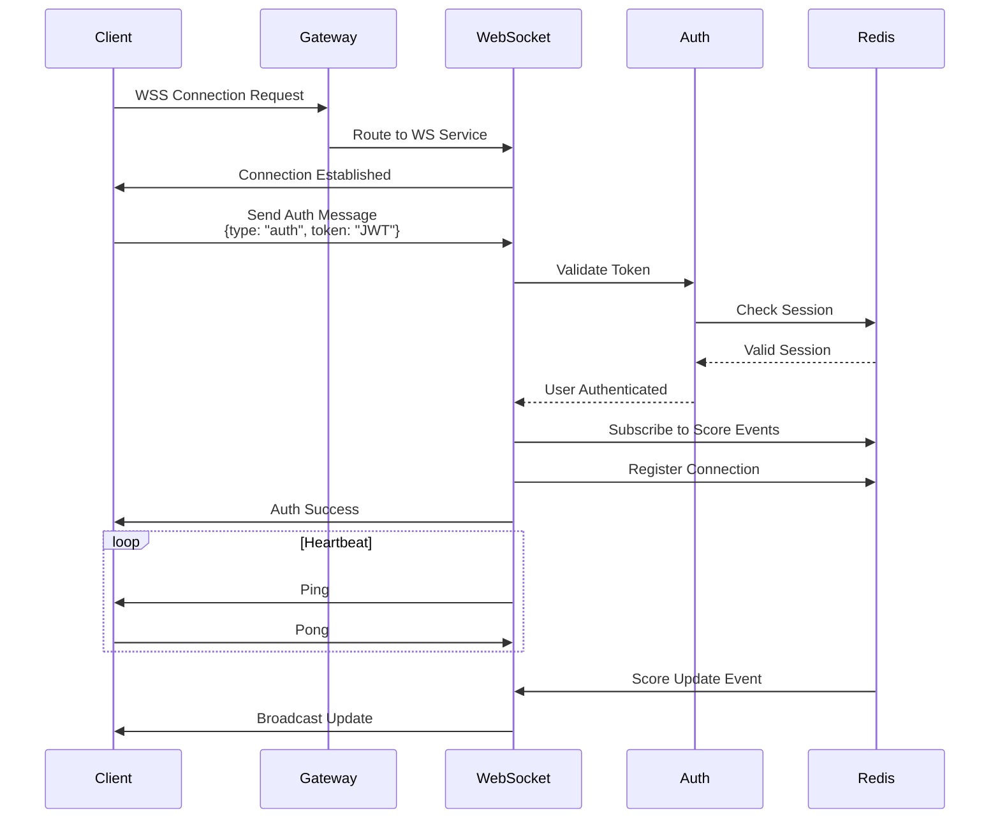
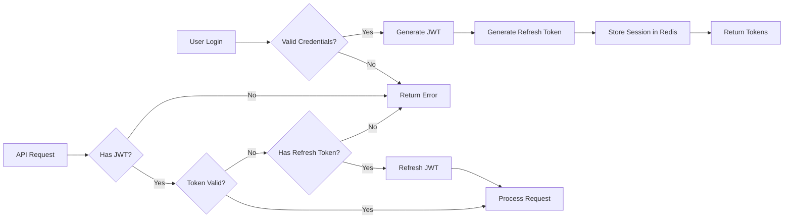
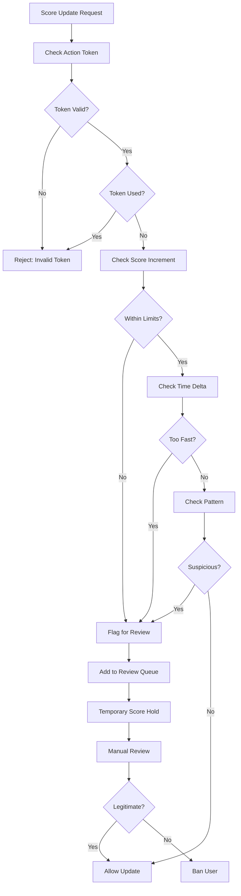
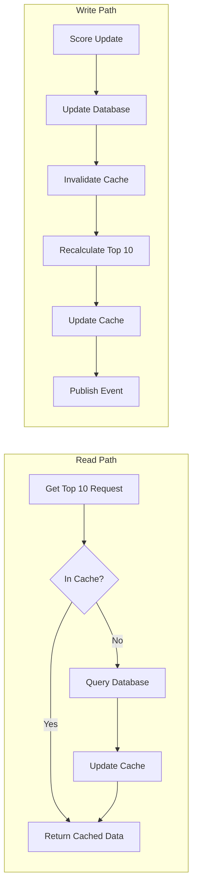
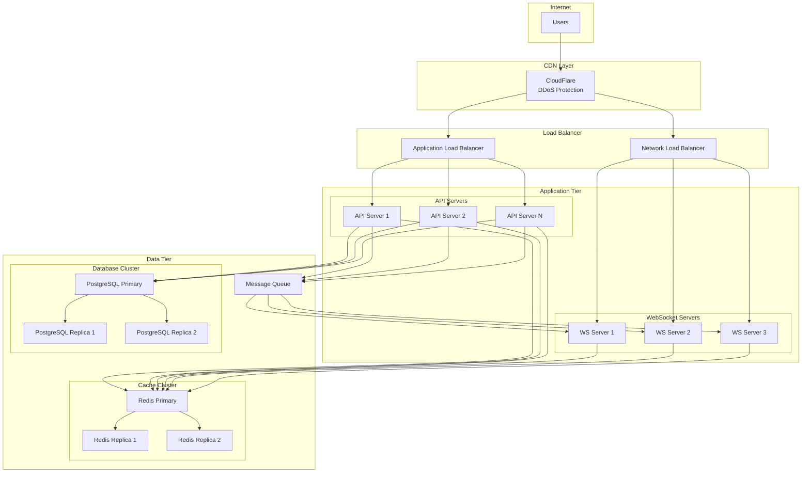
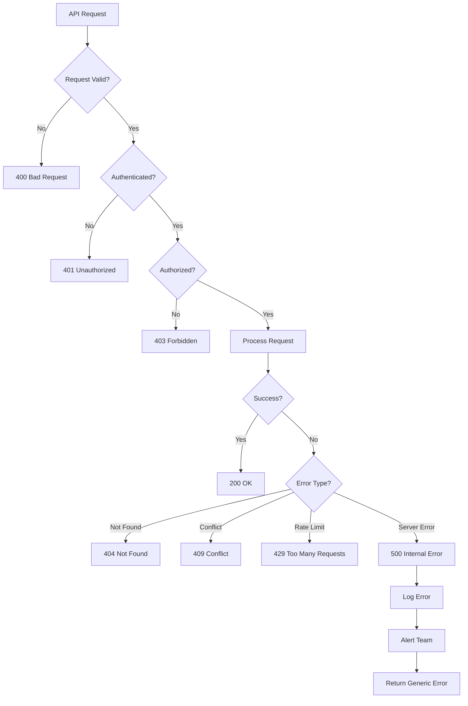
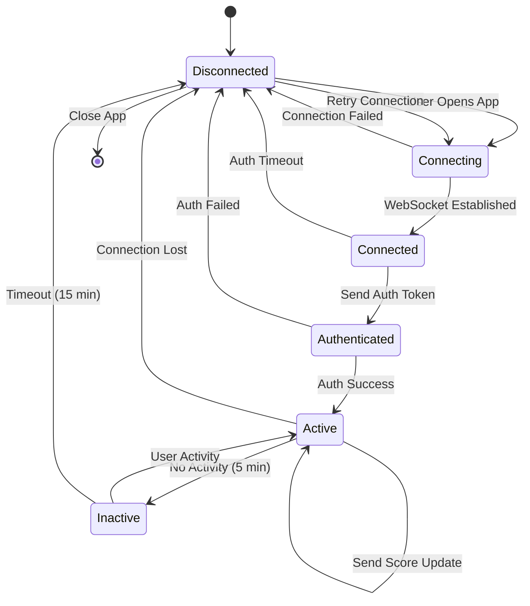

# Live Scoreboard System Flow Diagram

## System Architecture Diagram

## Score Update Flow Sequence

## WebSocket Connection Flow

## Authentication Flow

## Anti-Cheat Validation Flow

## Cache Strategy Flow

## Deployment Architecture

## Error Handling Flow

## State Management Flow

## Data Flow Summary

1. **User Action → Score Update**
   - User completes action in client
   - Client sends authenticated request to API
   - API validates request and updates database
   - Cache is updated with new scores
   - Event is published to message queue

2. **Score Update → Live Updates**
   - Message queue delivers event to WebSocket service
   - WebSocket service retrieves updated leaderboard
   - Updates are broadcast to all connected clients
   - Clients update their UI in real-time

3. **Security Checkpoints**
   - JWT validation at API Gateway
   - Action token validation in Score Service
   - Anti-cheat rules enforcement
   - Rate limiting at multiple levels
   - Audit logging for all actions

4. **Performance Optimizations**
   - Redis cache for frequent queries
   - Database read replicas for scalability
   - Message queue for asynchronous processing
   - WebSocket connection pooling
   - CDN for static assets
